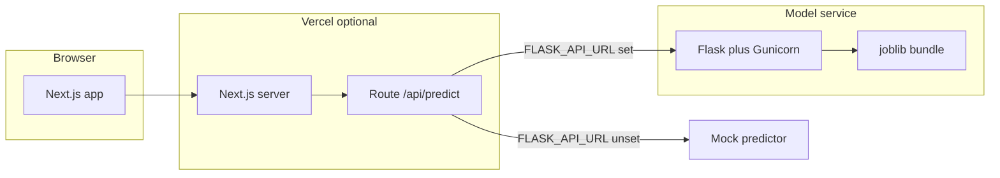

# Parkinson's disease voice biomarker - ML detector (full stack)

End-to-end **binary classification** project: voice features from the classic **Parkinson's speech dataset** - **dimensionality reduction (PCA)** - **multiple classifiers** - **trained artifact** served by a **Flask API**, with a **Next.js** web UI, interactive **documentation with metrics and ROC curves**, and **Docker / Render / Vercel** deployment paths.

> **Not a medical device.** This repository is for education use only. Do not use for diagnosis or clinical decisions.

---

## Highlights

| Area | Summary |
|------|---------|
| **Best hold-out accuracy** | **84.62%** - *Decision Tree* and *KNN (k=3)* (tied on the exported test split) |
| **Best ROC-AUC** | **0.792** - *Random Forest (gini)* |
| **Pipeline** | PCA retains **95%** variance in **3** components; **80/20** train/test, `random_state=7` |
| **UI** | Form for 22 voice features, ensemble-style results; **[live `/docs` with ROC & charts](https://detecting-parkinsons-disease.vercel.app/docs)** (data: `notebook-docs-metrics.json`) |
| **API** | Flask `/predict` + `/health`; optional proxy via Next.js `POST /api/predict` and `FLASK_API_URL` |


---

## Live docs: charts, ROC curves, notebook figures

**Deployed app:** **[Model documentation (live)](https://detecting-parkinsons-disease.vercel.app/docs)** — same content as local `/docs`.

On that page you get:

- **Overall performance** — interactive **bar chart** (accuracy, precision, recall, F1) for all models on the hold-out test set.
- **Per-model tabs** — numeric metrics plus an **interactive ROC curve** (TPR vs FPR, chance diagonal) for each classifier; AUC matches the exported `roc_auc` values.
- **Notebook figures** — exported **PNG plots** from the analysis notebook (distributions, per-model ROC/plot images), organized by model with anchors like `/docs#random-forest-gini`.

The **table below** mirrors those numbers in plain Markdown for GitHub/README viewers without opening the site. ROC **curve coordinates** live in [`UI/data/notebook-docs-metrics.json`](UI/data/notebook-docs-metrics.json) (field `roc_curve` per model).

---

## Key figures from documentation (test set)

Values are taken from [`UI/data/notebook-docs-metrics.json`](UI/data/notebook-docs-metrics.json), generated by [`scripts/export_notebook_docs_metrics.py`](scripts/export_notebook_docs_metrics.py) to mirror the analysis notebook pipeline (see `meta.deviations_from_notebook` in the JSON for small intentional differences vs. the raw notebook).

### Pipeline (reproducibility)

- **Data file:** `parkinsons.data` (voice recordings summarized as numerical features; binary `status`: Parkinson's vs healthy).
- **Features:** 22 numeric voice measures (after dropping `name` / label columns in modeling).
- **PCA:** variance retained **0.95** - **3** components (raw features fed into PCA, consistent with notebook export notes).
- **Split:** `test_size=0.2`, `random_state=7`.
- **Positive class for metrics:** Parkinson's.

### Model performance (% = test-set scores; ROC-AUC is 0-1 scale)

| Model | Accuracy | Precision | Recall | F1 | ROC-AUC |
|-------|----------|-----------|--------|-----|---------|
| Logistic Regression | 82.05 | 83.78 | 96.88 | 89.86 | 0.688 |
| Decision Tree | **84.62** | 90.63 | 90.63 | 90.63 | 0.739 |
| Random Forest (gini) | 79.49 | 85.29 | 90.63 | 87.88 | **0.792** |
| Random Forest (entropy) | 79.49 | 85.29 | 90.63 | 87.88 | 0.779 |
| SVM | 82.05 | 83.78 | 96.88 | 89.86 | 0.737 |
| KNN (k=3) | **84.62** | 90.63 | 90.63 | 90.63 | 0.763 |
| Gaussian NB | 74.36 | 84.38 | 84.38 | 84.38 | 0.719 |
| Bernoulli NB | 79.49 | 83.33 | 93.75 | 88.24 | 0.725 |
| Voting ensemble | 79.49 | 85.29 | 90.63 | 87.88 | 0.781 |
| XGBoost | 76.92 | 87.10 | 84.38 | 85.71 | 0.621 |

**Takeaway:** Highest **accuracy** on this split is shared by **Decision Tree** and **KNN**; **Random Forest (gini)** achieves the strongest **ROC-AUC** (ranking / separability). The live API may aggregate votes across several models in the bundled `joblib` artifact; see `api/app.py` and the training notebook for details.

**View charts and ROC on the web:** [detecting-parkinsons-disease.vercel.app/docs](https://detecting-parkinsons-disease.vercel.app/docs) — or locally: `http://localhost:3000/docs`.

---

## Architecture



---

## Tech stack

- **ML / backend:** Python, Flask, scikit-learn, XGBoost, pandas, joblib, Gunicorn (production).
- **Frontend:** Next.js (App Router), React, TypeScript, Tailwind CSS, shadcn/ui, Recharts.
- **Ops:** Docker (`api/Dockerfile`), `render.yaml`, deployment notes in [`DEPLOY.md`](DEPLOY.md).

---

## Repository layout

| Path | Role |
|------|------|
| `Detecting_Parkinson's_Disease_.ipynb` | Exploratory modeling and training narrative |
| `parkinsons.data` | Dataset (CSV) |
| `api/` | Flask app, `feature_config.py`, `train_model.py`, `models/*.joblib` |
| `UI/` | Next.js application (`/`, `/docs`, `/api/predict`) |
| `UI/data/notebook-docs-metrics.json` | Exported metrics + ROC points for `/docs` |
| `scripts/export_notebook_docs_metrics.py` | Regenerate metrics JSON from the notebook pipeline |

---

## Quick start (local)

**1. Flask API**

```bash
cd api
python -m venv .venv
# Windows: .venv\Scripts\activate
pip install -r requirements.txt
python app.py
```

**2. Next.js UI**

```bash
cd UI
npm install
# Optional: copy UI/.env.example to .env.local and set FLASK_API_URL=http://127.0.0.1:5000
npm run dev
```

Open the dev URL (usually `http://localhost:3000`). Documentation and charts: `http://localhost:3000/docs`.

**3. Refresh docs metrics from the notebook**

```bash
python scripts/export_notebook_docs_metrics.py
```

(Uses the notebook and dataset paths configured inside that script.)

---
